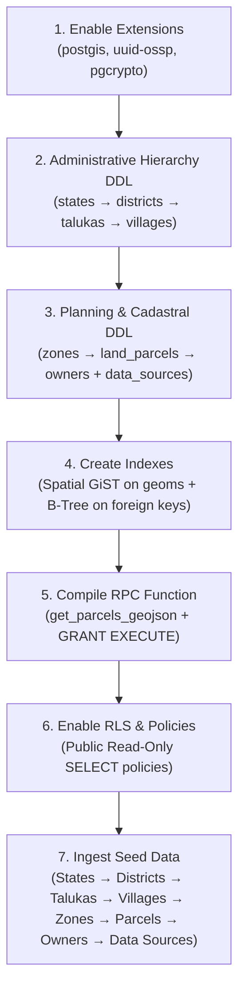
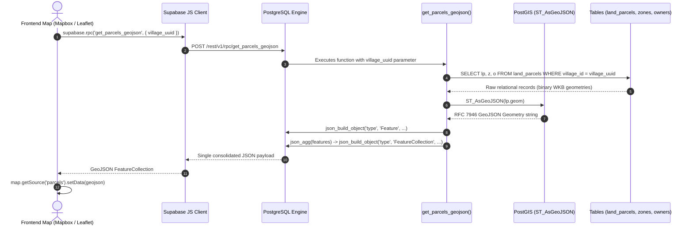

# Execution Flow & System Call Graph (`execution_of_flow.md`)

> **Project**: map-bro (Supabase + PostGIS Cadastral & Zoning Lookup Prototype)  
> **Topic**: Entry points, deterministic execution order, function call hierarchy, and session change logs.

---

## 1. System Entry Points

The codebase provides three distinct entry points depending on the runtime context:

```
                          ┌───────────────────────────┐
                          │   System Entry Points     │
                          └─────────────┬─────────────┘
                                        │
     ┌──────────────────────────────────┼──────────────────────────────────┐
     │                                  │                                  │
     ▼                                  ▼                                  ▼
[Local Supabase CLI]         [Cloud SQL / Direct DB]            [Client Application API]
`npx supabase db reset`      `supabase/schema_and_seed.sql`     `supabase.rpc('get_parcels_geojson')`
```

### Entry Point A: Local Supabase CLI
* **Command**: `npx supabase start` or `npx supabase db reset`
* **Entry Path**: Reads `supabase/config.toml` &rarr; sequentially applies migrations in `supabase/migrations/` &rarr; applies `supabase/seed.sql`.

### Entry Point B: Supabase Cloud SQL Editor / `psql` Connection
* **File**: [`supabase/schema_and_seed.sql`](file:///d:/map-bro/supabase/schema_and_seed.sql)
* **Entry Path**: 1-click execution that creates the entire database schema, spatial indexes, RPC functions, RLS policies, and demo seed data in a single transactional script.

### Entry Point C: Frontend / API Client Entry Point
* **Library**: `@supabase/supabase-js`
* **Entry Function**:
  ```typescript
  import { createClient } from '@supabase/supabase-js';
  const supabase = createClient(SUPABASE_URL, SUPABASE_ANON_KEY);

  // Core Map Fetch Entry Point
  const { data: featureCollection, error } = await supabase.rpc(
    'get_parcels_geojson',
    { village_uuid: 'a4444444-4444-4444-4444-444444444441' }
  );
  ```

---

## 2. Deterministic Database Execution Order

Because relational databases enforce strict foreign key and type dependencies, initialization must execute in the following exact sequence:



### Detailed Step-by-Step Order:
1. **Extensions Activation**:
   - `postgis`: Registers geometric types (`geometry`, `ST_*` functions).
   - `uuid-ossp` & `pgcrypto`: Registers `gen_random_uuid()` generator.
2. **DDL Table Hierarchy (Parent &rarr; Child)**:
   - `states` (no foreign keys)
   - `districts` (depends on `states.id`)
   - `talukas` (depends on `districts.id`)
   - `villages` (depends on `talukas.id`)
   - `zones` (depends on `villages.id`)
   - `land_parcels` (depends on `villages.id` and nullable `zones.id`)
   - `owners` (depends on `land_parcels.id`)
   - `data_sources` (standalone reference registry)
3. **Index Creation**:
   - Spatial GiST indexes on `land_parcels.geom`, `zones.geom`, `villages.geom`.
   - Relational B-tree indexes on `land_parcels.village_id` and all parent FK columns.
4. **Stored Procedure Compilation**:
   - Compiles `get_parcels_geojson(UUID)` and grants `EXECUTE` permissions to `anon`, `authenticated`, and `service_role`.
5. **Row Level Security (RLS)**:
   - Enables RLS on all 8 tables.
   - Applies read-only `SELECT` policies for public access.
6. **Data Seeding**:
   - Inserts Gujarat & Maharashtra administrative entities &rarr; 4 villages &rarr; 2 planning zones &rarr; 10 mock parcels &rarr; 10 mock owners &rarr; 5 production data source reference records.

---

## 3. Function Call Hierarchy & Data Flow Trace

When a web client requests parcel data for map rendering, the call chain executes through the following nested sub-functions:



### Internal PostgreSQL Function Call Breakdown:

```
get_parcels_geojson(village_uuid)
 │
 ├── 1. Query Execution & Filters:
 │    ├── Filter: `land_parcels.village_id = village_uuid` (Using B-Tree index)
 │    ├── LEFT JOIN: `zones` on `land_parcels.zone_id = zones.id`
 │    └── LEFT JOIN: `owners` on `land_parcels.id = owners.parcel_id`
 │
 ├── 2. Spatial Geometry Conversion:
 │    └── ST_AsGeoJSON(lp.geom)  [PostGIS C-extension converts WKB to GeoJSON string]
 │         └── ::json             [Postgres core casts string to native JSON]
 │
 ├── 3. Feature Assembly:
 │    └── json_build_object(
 │          'type', 'Feature',
 │          'id', lp.id,
 │          'geometry', <ST_AsGeoJSON result>,
 │          'properties', json_build_object(...)
 │        )
 │
 └── 4. FeatureCollection Aggregation:
      ├── json_agg(...)            [Aggregates all feature JSON objects into a JSON array]
      ├── COALESCE(..., '[]'::json) [Guarantees empty array if zero parcels match]
      └── json_build_object(
            'type', 'FeatureCollection',
            'features', <aggregated array>
          )
```

---

## 4. Code Changes Log for this Session

The table below documents every file created or updated during this development session:

| File Path | Status | Purpose & Description of Changes |
| :--- | :---: | :--- |
| [`supabase/config.toml`](file:///d:/map-bro/supabase/config.toml) | **Created** | Initialized local Supabase project configuration via CLI (`supabase init`). |
| [`supabase/migrations/20260820000000_initial_schema.sql`](file:///d:/map-bro/supabase/migrations/20260820000000_initial_schema.sql) | **Created & Enhanced** | Primary migration file containing extensions (`postgis`, `pgcrypto`, `uuid-ossp`), 8 hierarchical tables, GiST & B-tree indexes, RPC function `get_parcels_geojson`, RLS policies, and extensive inline architectural comments explaining the "why". |
| [`supabase/seed.sql`](file:///d:/map-bro/supabase/seed.sql) | **Created** | Comprehensive demo dataset for Gujarat and Maharashtra, 4 villages with MultiPolygon geometries, 2 planning zones, 10 mock land parcels with Polygon boundaries, 10 mock owners, and 5 reference data sources. |
| [`supabase/schema_and_seed.sql`](file:///d:/map-bro/supabase/schema_and_seed.sql) | **Created** | Standalone consolidated SQL script combining schema migration + seed data for direct 1-click execution in Supabase Cloud SQL Editor or `psql`. |
| [`Decisions.md`](file:///d:/map-bro/Decisions.md) | **Created** | In-depth architectural decision record (ADR) logging the rationale behind database engine choice, PostGIS geometry types, spatial indexing, RPC GeoJSON aggregation, and synthetic data ethics. |
| [`Descisions.md`](file:///d:/map-bro/Descisions.md) | **Created** | Document alias referencing `Decisions.md` to prevent broken links from spelling variations. |
| [`execution_of_flow.md`](file:///d:/map-bro/execution_of_flow.md) | **Created** | Complete execution flow documentation detailing entry points, dependency order, call traces, and session modifications. |
